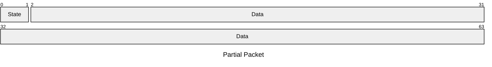
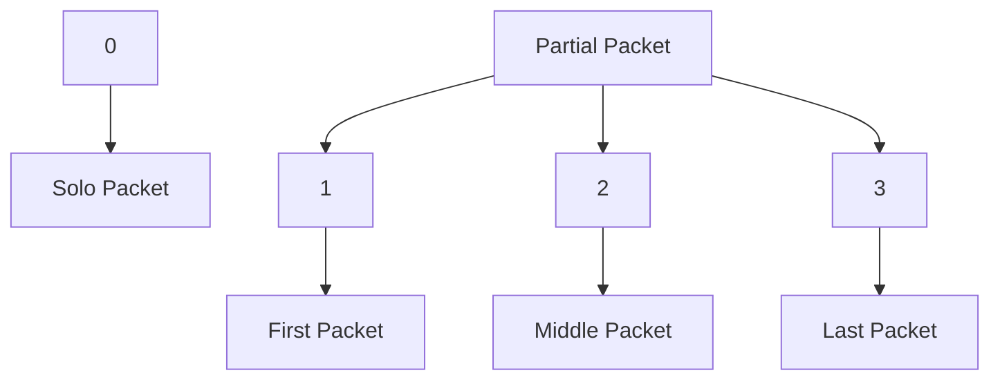

---
tags:
  - Netcode
cssclasses:
  - code
---
The Steam SDK has a maximum package size of 1200 bytes. However, when sending the complete world state to a newly joined user, the byte stream can exceed this limit. To handle this, I designed a system that splits large byte streams into smaller chunks before sending them. The recipient then reconstructs the original byte stream from these chunks before deserializing it back into game data.
### Packet Breakdown
The first byte of the packet represents the state ID, while the subsequent bytes carry the actual data.

### Packet State ID's

### Reconstructing the Packets
When reconstructing the packets, the system checks the state ID. If a packet is received with a state ID of 1, the system will read and append additional packets until the state ID of 3 (the last part) is reached. This ensures the byte stream is correctly reassembled before deserialization.